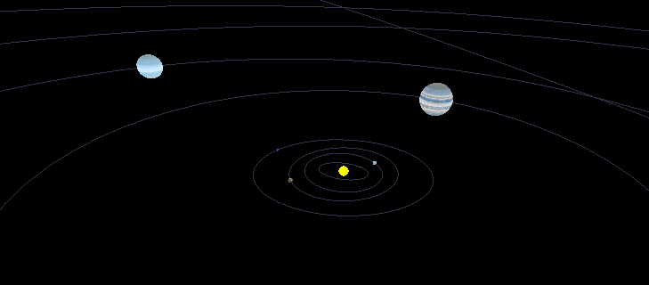

# Planetarium

This is a solar system model.

It uses OpenGL and SDL for graphics and ui.

Data mostly from [nasa factsheet](https://nssdc.gsfc.nasa.gov/planetary/factsheet/).

Textures from [solarsystemscope](https://www.solarsystemscope.com)

## Starting

Add Planetarium to the quickload load path and start its main function

    (ql:quickload 'planetarium)
    (planetarium::main)

On my Linux system I need to add `/usr/lib/x86_64-linux-gnu` to the path, otherwise SDL2 does not get loaded.

## Navigation

Currently the navigation is always centered on the sun, and you move in a sphere around it. Real 6 dof navigation should be implemented eventually.

You can navigate using the keyboard:

* ↑ - view pitch up
* ↓ - view pitch down
* ← - roll left
* → - roll right
* w - move forward toward the center
* s - move away from the center
* a - rotate view left
* d - rotate view right
* t - toggle planets rescaling - useful because planets are too small in their actual size
* . - increase time rate
* , - decrease time rate
* r - reset camera
* o - toggle orbits drawing
* 8 - fast travel
* 6 - slow travel

## Inaccuracies

Note that this is a simple simulation of planets moving in predefined orbits, and thus far from a "real" Solar system simulation.

There also is no "phase" information, and thus all planets start at the same radial line.

## License

GPL-2.0
